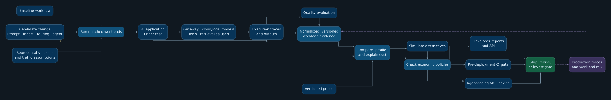

# CostGuard: project vision

This is a working direction for CostGuard, not a fixed specification or a list of what the repository already implements. We expect the design to evolve as we learn from real workloads.

CostGuard aims to be an **economic intelligence, profiling, and regression-testing layer for AI applications**. Its primary job is to help teams understand the economic effect of a proposed change *before it ships*: what became more or less expensive, why, whether quality or latency changed, and whether the result stays within the team's constraints.

The unit of analysis is a workload, not an isolated token count. Prompts, model selection, routing, context size, retries, tool calls, retrieval, and agent behavior can all change the cost and outcome of one request. CostGuard should turn observed execution evidence into comparable, explainable decisions.

## Intended workflow

[Open the full-size SVG](docs/costguard-workflow.svg) · [Edit the diagram source](docs/costguard-workflow.dot)

Baseline and candidate should be measured on representative cases with explicit prices and traffic assumptions. CostGuard should preserve enough evidence to attribute a difference to models, prompts, routes, retries, tools, retrieval, or longer execution paths—not merely report a new total. Where evidence is missing or estimated, the result should say so rather than imply certainty.

Production traces can later refine the workload mix and test whether pre-deployment predictions matched actual spending. Simulations should make their assumptions visible: repricing an observed trace is different from predicting how a new model will behave.

## Questions the product should answer

- What is costing us money, and where are the hotspots?
- What changed between a baseline and a candidate, and why?
- How do alternatives compare across cost, quality, latency, and expected production impact?
- What might a proposed change cost under stated workload and traffic assumptions?
- Does the change satisfy our economic policies, or is the evidence inconclusive?

Developers should be able to explore these questions locally and in CI. Coding agents should be able to ask them through an MCP interface before recommending or taking an expensive action. CostGuard should complement gateways, observability, tracing, and evaluation systems by consuming their data and adding economic understanding; it need not replace them. Retrieval and RAG are relevant when the application uses them, not mandatory CostGuard components.

The path toward this vision should be incremental: establish trustworthy baseline-versus-candidate evidence first, then deepen attribution, simulation, policy, and production feedback as real use cases justify them.
